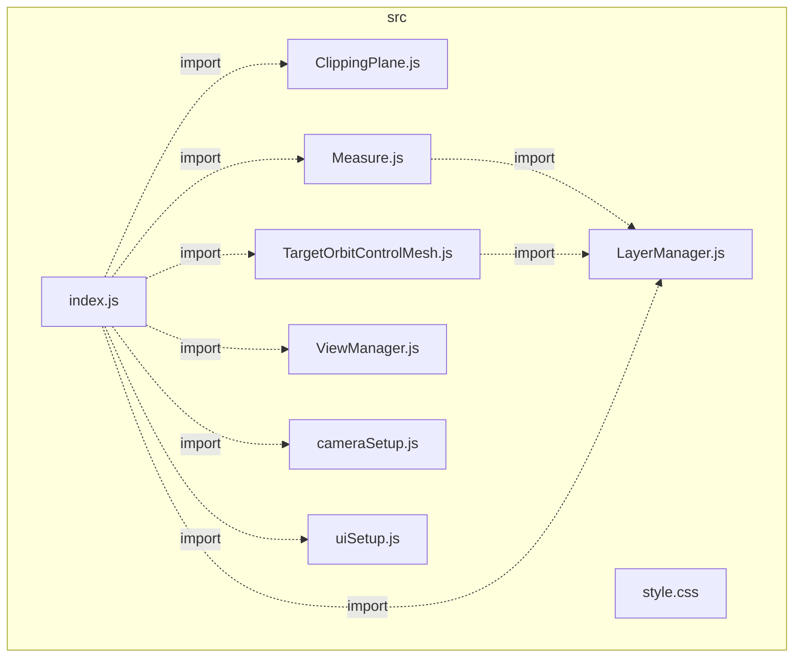

```mermaid
flowchart
 subgraph IDsrc["src"]
  IDsrcClippingPlane2ejs["ClippingPlane.js"]
  IDsrcLayerManager2ejs["LayerManager.js"]
  IDsrcMeasure2ejs["Measure.js"]
  IDsrcTargetOrbitControlMesh2ejs["TargetOrbitControlMesh.js"]
  IDsrcViewManager2ejs["ViewManager.js"]
  IDsrcCameraSetup2ejs["cameraSetup.js"]
  IDsrcIndex2ejs["index.js"]
  IDsrcStyle2ecss["style.css"]
  IDsrcUiSetup2ejs["uiSetup.js"]
 end
IDsrcMeasure2ejs-.->|import|IDsrcLayerManager2ejs
IDsrcTargetOrbitControlMesh2ejs-.->|import|IDsrcLayerManager2ejs
IDsrcIndex2ejs-.->|import|IDsrcClippingPlane2ejs
IDsrcIndex2ejs-.->|import|IDsrcTargetOrbitControlMesh2ejs
IDsrcIndex2ejs-.->|import|IDsrcViewManager2ejs
IDsrcIndex2ejs-.->|import|IDsrcLayerManager2ejs
IDsrcIndex2ejs-.->|import|IDsrcCameraSetup2ejs
IDsrcIndex2ejs-.->|import|IDsrcUiSetup2ejs
IDsrcIndex2ejs-.->|import|IDsrcMeasure2ejs
```
>This file has been generated using autoMermaid.js